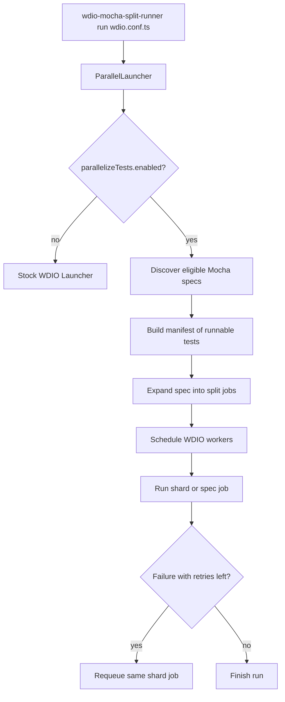
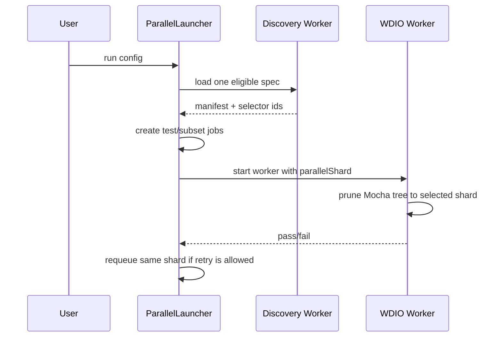

# `@jm/wdio-mocha-split-runner`

Experimental Mocha-first intra-spec parallel runner for WebdriverIO.

This package wraps the stock WDIO launcher and can split a single Mocha spec file into multiple worker jobs before execution starts. It is aimed at suites where a few large spec files dominate total runtime and file-level parallelism is not enough.

## What It Solves

Normal WDIO scheduling is spec-file based:

- one worker gets one spec file
- tests inside that file still run serially
- one heavy file can become the bottleneck

This package adds an optional split phase:

- discover runnable tests in an eligible Mocha spec
- expand that spec into one or more shard jobs
- schedule those shard jobs through normal WDIO workers
- rerun only the failing shard when split-job retries are enabled

## Features

- Mocha-only intra-file parallelization
- per-file concurrency limiting with `maxTestsPerFile`
- global split-job limiting with `maxSplitInstances`
- file-path based filters for which specs and discovered tests can split
- shard-level retry support through `parallelizeTests.retries`
- fallback to stock WDIO scheduling when split mode is disabled
- runnable Chrome example scenarios and Chrome e2e coverage

## Install

```bash
npm install @jm/wdio-mocha-split-runner
```

## Run

Use the package binary instead of the stock `wdio` command:

```bash
npx wdio-mocha-split-runner run ./wdio.conf.ts
```

Example script:

```json
{
  "scripts": {
    "test:e2e": "wdio-mocha-split-runner run ./wdio.conf.ts"
  }
}
```

## Basic Config

```ts
export const config: WebdriverIO.Config = {
    runner: 'local',
    framework: 'mocha',
    specs: ['./test/specs/**/*.e2e.ts'],
    maxInstances: 2,
    capabilities: [{
        browserName: 'chrome',
        'wdio:maxInstances': 2
    }],
    parallelizeTests: {
        enabled: true
    }
}
```

## `parallelizeTests`

```ts
type ParallelizeTestsConfig = {
  enabled: boolean
  maxTestsPerFile?: number
  maxSplitInstances?: number
  include?: string[]
  tests?: string[]
  retries?: number
}
```

Behavior:

- `enabled`: turns split mode on
- `maxTestsPerFile`: max number of split jobs from the same spec file that may run at once
- `maxSplitInstances`: max number of split jobs that may run at once across the full run
- `include`: matches spec file paths by substring or wildcard pattern
- `tests`: matches discovered test file paths by substring or wildcard pattern
- `retries`: retry count for split jobs, defaulting to `config.specFileRetries`

Scheduling precedence:

- `config.maxInstances`
- capability-level `wdio:maxInstances`
- `parallelizeTests.maxSplitInstances`
- `parallelizeTests.maxTestsPerFile`

Notes:

- `tests` matches discovered test file paths only, not Mocha titles
- `maxSplitInstances` applies only to split jobs, not normal spec jobs
- `mochaOpts.retries` must be `0` when split mode is enabled

## Workflow

### High-Level Flow



### Split Execution Lifecycle



## Examples

The checked-in example scenarios live in [example/](/Users/justas/Desktop/custom-runner/custom-runner/example). All of them use Chrome headless.

Main example configs:

- [example/wdio.conf.ts](/Users/justas/Desktop/custom-runner/custom-runner/example/wdio.conf.ts): split only `mixed.e2e.ts`
- [example/wdio.stock.conf.ts](/Users/justas/Desktop/custom-runner/custom-runner/example/wdio.stock.conf.ts): stock WDIO scheduling with split mode off
- [example/wdio.global-limit.conf.ts](/Users/justas/Desktop/custom-runner/custom-runner/example/wdio.global-limit.conf.ts): two split files with `maxSplitInstances: 2`
- [example/wdio.retry.conf.ts](/Users/justas/Desktop/custom-runner/custom-runner/example/wdio.retry.conf.ts): flaky shard retry example

Run them:

```bash
npm run example:stock
npm run example:split
npm run example:global-limit
npm run example:retry
```

### Example: Split One Heavy File

```ts
export const config: WebdriverIO.Config = {
    runner: 'local',
    framework: 'mocha',
    specs: ['./specs/alpha.e2e.ts', './specs/mixed.e2e.ts'],
    maxInstances: 2,
    capabilities: [{
        browserName: 'chrome'
    }],
    parallelizeTests: {
        enabled: true,
        include: ['**/mixed.e2e.ts'],
        maxTestsPerFile: 5
    }
}
```

Expected behavior:

- `alpha.e2e.ts` stays a normal spec job
- `mixed.e2e.ts` is discovered and split into multiple jobs
- up to 2 jobs run at once because `maxInstances` is `2`

### Example: Global Split Cap

```ts
parallelizeTests: {
    enabled: true,
    include: ['**/limit-a.e2e.ts', '**/limit-b.e2e.ts'],
    maxTestsPerFile: 2,
    maxSplitInstances: 2
}
```

Expected behavior:

- both files can split
- no more than 2 split jobs run at once across the entire run
- normal spec jobs are not counted against `maxSplitInstances`

### Example: Shard-Level Retry

```ts
parallelizeTests: {
    enabled: true,
    include: ['**/flaky.e2e.ts'],
    retries: 1
}
```

Expected behavior:

- a failing split job is retried as the same shard
- other passing shard jobs are not rerun
- this is different from stock spec-level retry behavior

## Hooks

Launcher hooks:

- `onPrepare`: once per launcher run
- `onComplete`: once per launcher run

Discovery behavior:

- initializes enough WDIO worker lifecycle to load the spec safely
- runs `beforeSession`
- does not run full test execution lifecycle

Execution jobs:

- run through normal WDIO worker startup
- receive `parallelizeTestsContext`
- prune the Mocha tree to one selected test or subset before execution

Discovery context:

```ts
parallelizeTestsContext: {
    phase: 'discover',
    specFile: string
}
```

Execution context:

```ts
parallelizeTestsContext: {
    phase: 'run',
    specFile: string,
    selectorId?: string,
    selectorIds?: string[]
}
```

If your hooks do side effects, guard discovery mode explicitly:

```ts
beforeSession(config) {
    if (config.parallelizeTestsContext?.phase === 'discover') {
        return
    }

    // side effects
}
```

## Current Constraints

- Mocha only
- grouped spec arrays are not split
- watch mode falls back to stock WDIO scheduling
- split-mode retries use job-level retries, not `mochaOpts.retries`

## Project Layout

- [src/](/Users/justas/Desktop/custom-runner/custom-runner/src): launcher, runtime, and Mocha shard logic
- [tests/](/Users/justas/Desktop/custom-runner/custom-runner/tests): unit tests and Chrome e2e tests
- [example/](/Users/justas/Desktop/custom-runner/custom-runner/example): runnable Chrome scenarios
- [bin/wdio-mocha-split-runner.js](/Users/justas/Desktop/custom-runner/custom-runner/bin/wdio-mocha-split-runner.js): package entrypoint

## Development

Install dependencies:

```bash
npm install
```

Main commands:

```bash
npm run test:unit
npm run build
npm run test:e2e
npm run test:all
```

Scenario commands:

```bash
npm run example:stock
npm run example:split
npm run example:global-limit
npm run example:retry
npm run example:all
```
